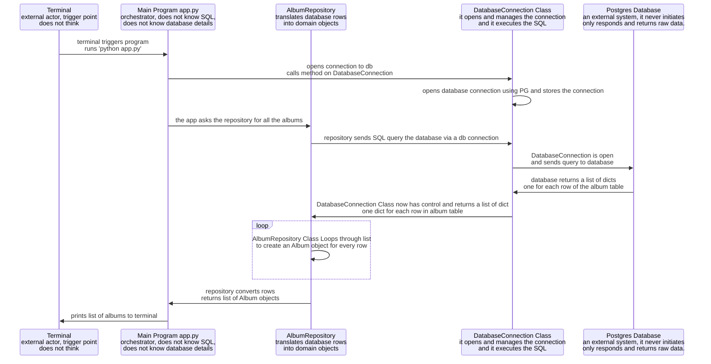

<!-- Create a sequence diagram for the album_repository. Make sure your diagram includes all of the challenge you completed in the previous section. Once you finish, upload your diagram and video to Aptem.

Make sure your diagram includes the following:
--The terminal
--The main program (app.py)
--The repository class
--The database connection class
--The database -->

